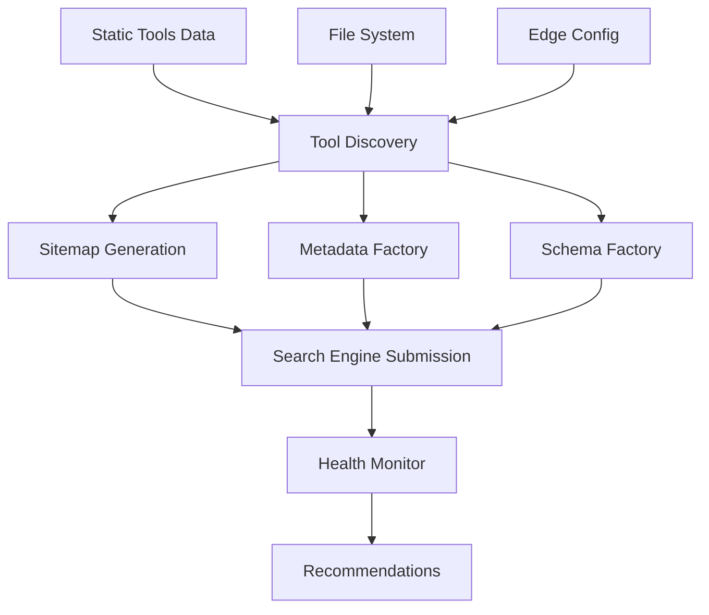

# SEO Automation System for ToolsLab

## 🚀 Overview

This comprehensive SEO automation system automatically discovers, optimizes, and submits your ToolsLab tools to search engines. It adapts to your project structure and provides real-time monitoring.

## 📋 Features

### ✅ Auto-Discovery

- **Smart Detection**: Automatically finds tools from multiple sources:
  - Static data (`/data/tools.ts`)
  - File system (existing tool pages)
  - Edge Config (dynamic configuration)
  - API routes
- **Category Discovery**: Finds all categories and static pages
- **Dynamic Routing**: Detects Next.js dynamic routes

### ✅ SEO Optimization

- **Dynamic Sitemap**: Auto-generates sitemap.xml with all discoverable content
- **Robots.txt**: Proper search engine directives
- **Metadata Factory**: Generates optimized meta tags for any tool
- **Structured Data**: JSON-LD schema markup for tools and categories
- **OG Images**: Dynamic Open Graph images for social sharing

### ✅ Search Engine Submission

- **IndexNow Protocol**: Instant submission to Bing, Yandex, Seznam, Naver
- **Google Pings**: Sitemap notifications to Google
- **Batch Processing**: Handles large numbers of URLs efficiently
- **Error Handling**: Comprehensive error reporting and retry logic

### ✅ Monitoring & Health Checks

- **Health Monitoring**: Continuous system health assessment
- **Performance Tracking**: Submission and discovery timing
- **Issue Detection**: Identifies missing pages, broken links
- **Automated Alerts**: Recommendations for improvements

## 🛠️ Installation & Setup

### 1. Generate IndexNow Key

```bash
npm run seo:generate-key
```

This will:

- Generate a 32-character API key
- Add it to `.env.local`
- Create the key file in `public/`
- Update `.gitignore`

### 2. Configure Environment Variables

Add to `.env.local`:

```env
# Site URL (required)
NEXT_PUBLIC_SITE_URL=https://toolslab.dev

# IndexNow API Key (auto-generated)
INDEXNOW_API_KEY=your_generated_key_here

# Search Engine Verification (optional)
GOOGLE_SITE_VERIFICATION=your_verification_code
BING_VERIFICATION=your_verification_code
YANDEX_VERIFICATION=your_verification_code
```

### 3. Test Discovery

```bash
npm run seo:discover
```

Expected output:

```
🔍 ToolsLab SEO Discovery Tool
================================

📊 Discovery Report:
===================
Discovery Time: 45ms
Dynamic Routing: Yes
Total Tools: 35
Enabled Tools: 35
Categories: 6
Static Pages: 3

🛠️ Tools Found:
================

STATIC-DATA (35 tools):
  ✅ json-formatter ⭐🔥
     → "JSON Formatter"
     → Category: text
  ✅ base64-encoder 🔥
     → "Base64 Encoder"
     → Category: converters
  ...
```

## 📚 Usage Guide

### Basic Commands

```bash
# Discovery - Find all tools and content
npm run seo:discover

# Submission - Submit to search engines
npm run seo:submit

# Monitoring - Health check and recommendations
npm run seo:monitor

# Full Pipeline - Discovery + Submission + Monitoring
npm run seo:full
```

### Advanced Commands

```bash
# Quick health check
npm run seo:monitor -- --quick

# Monitor with auto-submission
npm run seo:monitor -- --auto-submit

# Submit specific tool
npm run seo:submit tool json-formatter

# Force regenerate IndexNow key
npm run seo:generate-key -- --force
```

### API Endpoints

```bash
# Health check API
GET /api/seo/monitor
GET /api/seo/monitor?type=quick
GET /api/seo/monitor?type=stats

# Manual submission
POST /api/seo/monitor
{
  "action": "submit"
}

# Submit specific tool
POST /api/seo/monitor
{
  "action": "submit-tool",
  "toolSlug": "json-formatter"
}
```

## 🏗️ Architecture

### Core Components

```
lib/seo/
├── discovery.ts       # Tool and content discovery engine
├── metadata-factory.ts # Meta tags and SEO optimization
├── schema-factory.ts   # Structured data generation
├── auto-submit.ts      # Search engine submission
└── monitor.ts          # Health monitoring and reporting

app/
├── sitemap.ts          # Dynamic sitemap generation
├── robots.ts           # Search engine directives
└── api/og/route.tsx    # Dynamic OG image generation

scripts/
├── seo-discover.ts     # CLI discovery tool
├── seo-submit.ts       # CLI submission tool
├── seo-monitor.ts      # CLI monitoring tool
└── generate-indexnow-key.ts # Key generation utility
```

### Data Flow



## 🔧 Configuration

### Tool Discovery Sources

The system checks these sources in order:

1. **Static Data** (`/data/tools.ts`) - Primary source
2. **File System** - Existing tool pages in `/app/tools/`
3. **Edge Config** - Dynamic tool configuration
4. **API Routes** - Tool API endpoints

### Sitemap Priority Rules

- **Homepage**: 1.0
- **Featured Tools**: 0.9
- **Popular Tools**: 0.8
- **New Tools**: 0.85
- **Regular Tools**: 0.7
- **Categories**: 0.7
- **Static Pages**: 0.6

### Metadata Generation

For each tool, the system generates:

```typescript
{
  title: "Tool Name - Free Online Tool | ToolsLab",
  description: "Tool description with benefits",
  keywords: "relevant, keywords, for, seo",
  openGraph: { /* OG tags */ },
  twitter: { /* Twitter cards */ },
  alternates: { canonical: "canonical-url" },
  robots: { /* Indexing directives */ }
}
```

## 📊 Monitoring Dashboard

### Health Score Calculation

- **Infrastructure Issues**: -20 points each
- **Missing Pages**: -5 points each (max -25)
- **Submission Errors**: -10 points each
- **Performance Issues**: -5 points each

### Status Levels

- **🟢 Healthy** (90-100): Everything working perfectly
- **🟡 Warning** (70-89): Minor issues, system functional
- **🔴 Error** (0-69): Critical issues requiring attention

### Sample Health Report

```json
{
  "timestamp": "2024-01-15T10:30:00.000Z",
  "overall": {
    "status": "healthy",
    "score": 95
  },
  "tools": {
    "total": 35,
    "enabled": 35,
    "disabled": 0,
    "missingPages": []
  },
  "infrastructure": {
    "sitemap": { "accessible": true, "status": 200 },
    "robots": { "accessible": true, "status": 200 },
    "indexNowKey": { "valid": true, "accessible": true }
  },
  "search_engines": {
    "google": { "sitemapPinged": true },
    "bing": { "sitemapPinged": true },
    "indexNow": { "submitted": 43, "errors": [] }
  }
}
```

## 🚀 Deployment Integration

### Build Process

The system automatically runs during builds:

```bash
npm run build
# Runs: next build && npm run seo:submit && npm run seo:monitor --quick
```

### Vercel Integration

Add these to your Vercel environment:

```env
NEXT_PUBLIC_SITE_URL=https://your-site.vercel.app
INDEXNOW_API_KEY=your_key_here
GOOGLE_SITE_VERIFICATION=your_code
```

### GitHub Actions

```yaml
# .github/workflows/seo.yml
name: SEO Health Check
on:
  schedule:
    - cron: '0 6 * * *' # Daily at 6 AM
  workflow_dispatch:

jobs:
  seo-check:
    runs-on: ubuntu-latest
    steps:
      - uses: actions/checkout@v3
      - uses: actions/setup-node@v3
      - run: npm install
      - run: npm run seo:monitor
        env:
          NEXT_PUBLIC_SITE_URL: ${{ secrets.SITE_URL }}
          INDEXNOW_API_KEY: ${{ secrets.INDEXNOW_KEY }}
```

## 🐛 Troubleshooting

### Common Issues

**❌ "No tools discovered"**

```bash
# Check your static data
cat data/tools.ts
# Verify file structure
ls -la app/tools/
```

**❌ "Sitemap not accessible"**

```bash
# Test sitemap generation
curl https://your-site.com/sitemap.xml
# Check build logs
npm run build
```

**❌ "IndexNow key validation failed"**

```bash
# Regenerate key
npm run seo:generate-key -- --force
# Test key file
curl https://your-site.com/your-key.txt
```

**❌ "Search engine submission failed"**

```bash
# Check network and retry
npm run seo:submit
# Monitor for detailed errors
npm run seo:monitor
```

### Debug Mode

Enable detailed logging:

```bash
DEBUG=seo* npm run seo:discover
DEBUG=seo* npm run seo:submit
DEBUG=seo* npm run seo:monitor
```

## 📈 Performance Optimization

### Best Practices

1. **Regular Health Checks**: Run `seo:monitor` daily
2. **Batch Submissions**: Let system handle URL batching
3. **Cache Management**: Monitor cache performance
4. **Error Monitoring**: Set up alerts for submission failures

### Performance Metrics

- **Discovery**: < 100ms for 50 tools
- **Submission**: < 5s for 50 URLs
- **Health Check**: < 2s full scan
- **Quick Check**: < 500ms

## 🔮 Future Enhancements

### Planned Features

- [ ] Google Search Console integration
- [ ] Bing Webmaster Tools integration
- [ ] Performance tracking and analytics
- [ ] Advanced schema markup (FAQ, HowTo)
- [ ] Multi-language sitemap support
- [ ] Automated competitor analysis

### Contributing

The SEO system is designed to be extensible. Key extension points:

- **Discovery Sources**: Add new sources in `ToolDiscovery`
- **Metadata Templates**: Extend `MetadataFactory`
- **Schema Types**: Add schemas in `SchemaFactory`
- **Submission Targets**: Add services in `SEOAutoSubmitter`

## 📝 License & Support

This SEO automation system is part of ToolsLab and follows the same license.

**Support Channels:**

- GitHub Issues: Technical problems
- Documentation: This file and inline comments
- Health Monitor: Built-in recommendations

---

_Generated by ToolsLab SEO Automation System v1.0.0_
